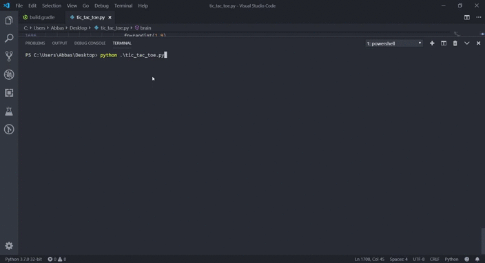

<h1>Tic Tac Toe</h1>

 

A Terminal Based Game(Tic Tac Toe) which incorporates a smart Intelligent
Algorithm(self Developed- different then traditionally developed Artificial
Intelligence Algorithm such as mini max ) which makes optimal strategy by assessing threats and deciding whether to proceed with offence or defense.

 
<h2>Demo<h2>

 

<h2> Download and Installation</h2>
<ul>
<li> Clone the repository</li>
<pre>https://github.com/mohammedabbas27/Tic-Tac-Toe.git</pre>
<li> Execution </li>
<pre>
Run the following command:
python main.py
</pre>
<small>© 2019 Mohammed Abbas.  All rights reserved.</small>
